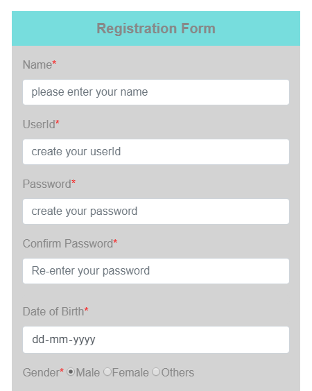
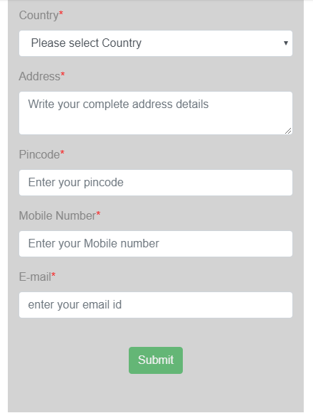

# Registration Form Using Angular

Registration-Form is a simple component for validating different input types.

In this form I have taken most of the input fields and I have performed all validations for each and every field. 

### Output Format
 
 

  
  

**To preview the demo of Registration-form please click here** : [Click here](https://angular-x66gqc-ichuxh.stackblitz.io)

#### Input Fields for which I have done validations are

name,userid,password,confirm password,Date of Birth,gender,country,address,pincode,mobile number and email address.

## Working process

For each field, if user enters invalid input it shows error message 

#### Validation for submit button--
After entering all the values still if user is entering any wrong inputs then submit button will be disabled, If everything is correct then only user will be allowed to submit this form,In case of success "Success" message will be shown to user.

## @Output Decorator
@Output has been used to provide user with required output.For this I have used EventEmitter, whenever some event will be called user will get result.

   **ngSubmit=function(userList){
     this.getobject.emit(userList)
   }**
   
Using this method user can get complete user details on the console in form of an array.

